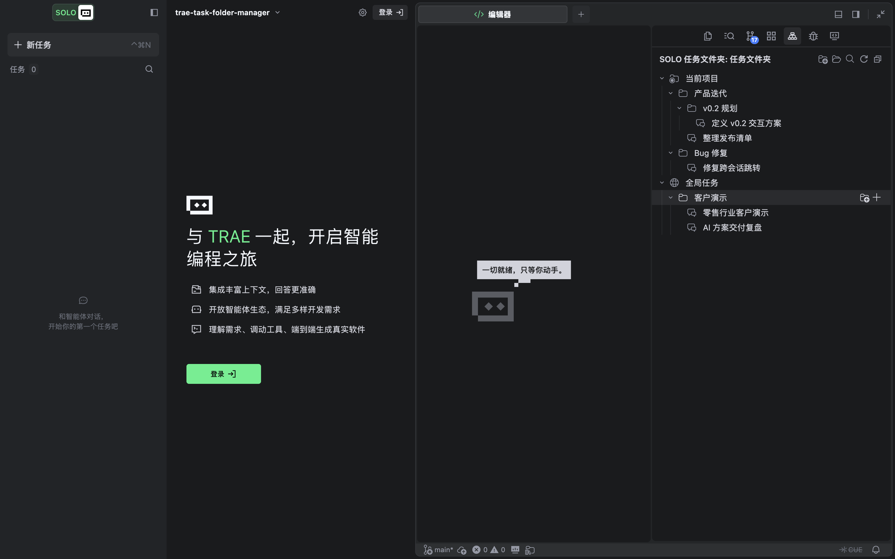
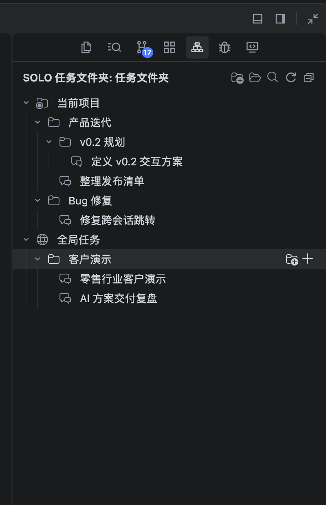
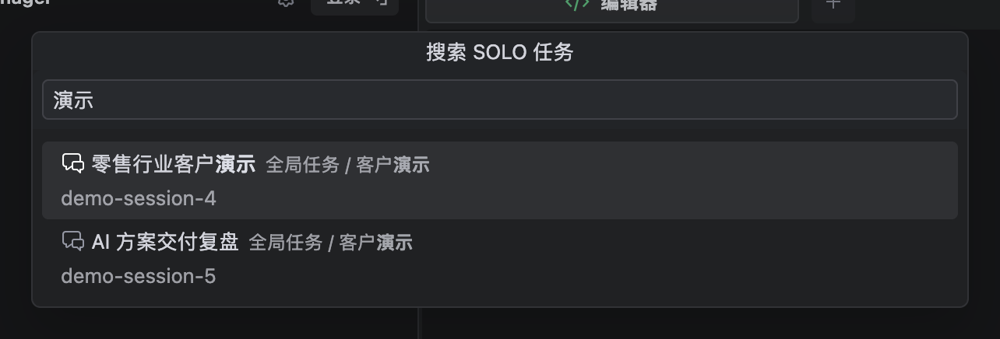

# SOLO Task Folders

[](CHANGELOG.md)
[](#兼容性)
[](LICENSE)

为 TraeCode SOLO 任务增加独立的文件夹视图，让分散的会话可以按项目、阶段和客户归档，并从文件夹快速返回对应对话。



> 截图来自隔离的扩展开发环境，内容均为演示数据。

## 核心能力

- 在“当前项目”和“全局任务”中创建任意层级的文件夹
- 将当前 SOLO 任务登记到指定文件夹
- 从文件夹中创建新的 SOLO 任务
- 拖拽移动任务与同一区域内的文件夹
- 重命名、移动、删除文件夹，或移除任务引用
- 按任务名、文件夹路径或 Session ID 搜索
- 点击任务返回对应 SOLO 对话
- 检查当前 TraeCode 版本的内部命令兼容性

删除文件夹或任务引用不会删除 TraeCode 中的原始 SOLO 对话。

## 界面预览

### 分层整理

项目任务与全局任务分别存储，支持多级目录和快捷操作。

<p align="center">
  
</p>

### 快速搜索

输入任务名称、文件夹路径或 Session ID，即可定位已登记任务。



## 安装

当前版本通过 VSIX 安装：

```bash
npm install
npm run vsix
```

生成文件位于 `dist/trae-task-folder-manager.vsix`。随后在 TraeCode 中：

1. 打开“扩展”。
2. 点击右上角 `...`。
3. 选择“从 VSIX 安装”。
4. 选择生成的 VSIX 文件并重新加载窗口。

也可以使用 TraeCode 命令行安装：

```bash
"/Applications/Trae CN.app/Contents/Resources/app/bin/trae-cn" \
  --install-extension dist/trae-task-folder-manager.vsix --force
```

## 使用

安装后，打开活动栏中的 **SOLO 任务文件夹**：

1. 在“当前项目”或“全局任务”上新建文件夹。
2. 在文件夹上点击 `+`，创建并自动登记一个 SOLO 任务。
3. 在已有对话中运行“将当前任务加入文件夹”。
4. 点击任务名称返回对应对话。

任务、文件夹和视图标题均支持右键菜单。工具栏还提供搜索、刷新和兼容性检查。

## 数据与隐私

- 项目目录保存在 TraeCode 的 `workspaceState`。
- 全局目录保存在 TraeCode 的 `globalState`。
- 扩展按 Session ID 从本机 renderer 日志中只读恢复任务名称。
- 扩展不读取对话正文，也不会修改 TraeCode 的私有数据库。
- 暂时无法恢复标题时，会显示稳定的“未命名任务”标签；再次登记时会自动尝试补全。

## 兼容性

建议使用 TraeCode `1.107` 或更高版本。

TraeCode 暂未公开 SOLO 任务管理 API。本扩展通过适配层调用当前版本可用的内部命令，因此 TraeCode 升级后可能需要同步适配。运行“SOLO 任务文件夹: 检查 TRAE 兼容性”可以查看当前支持情况。

直接打开失败时，扩展会打开原生任务搜索并自动填入完整任务名称。在 macOS 上授予辅助功能权限后，扩展还会确认首个匹配结果并校验 Session ID；权限不足或匹配失败时，搜索词仍会保留，用户按回车或点击结果即可打开。

macOS 辅助功能权限仅用于自动确认搜索结果，不影响文件夹、登记、移动和搜索等基础能力。

## 本地开发

```bash
npm install
npm run check
npm test
npm run build
```

按 `F5` 可在 Extension Development Host 中调试标准 VS Code 能力。TraeCode 私有命令需要安装 VSIX 后验证。

项目使用 TypeScript、esbuild 和 Node.js 内置测试运行器：

```text
src/      扩展源码
test/     单元测试
media/    活动栏图标
docs/     设计文档与截图
```

## 已知边界

标准 VS Code 扩展不能向 `icube-modules-ai-task-panel-v2` 原生任务组件插入节点，因此文件夹显示在独立的 Tree View 中，而不是修改 SOLO 自带任务列表。

## License

[MIT](LICENSE)

活动栏图标基于 Lucide `folder-trae` 图标，按 ISC License 使用。
